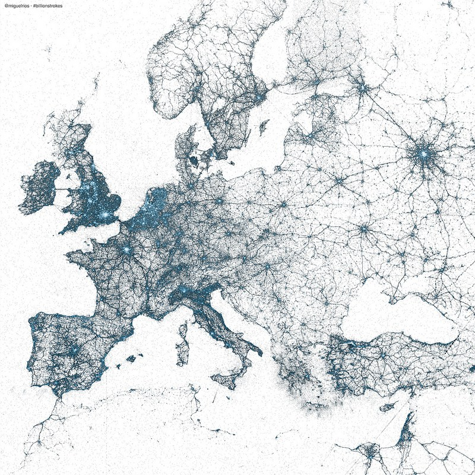
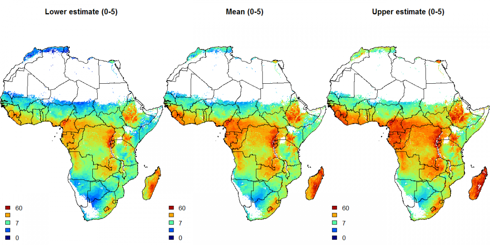
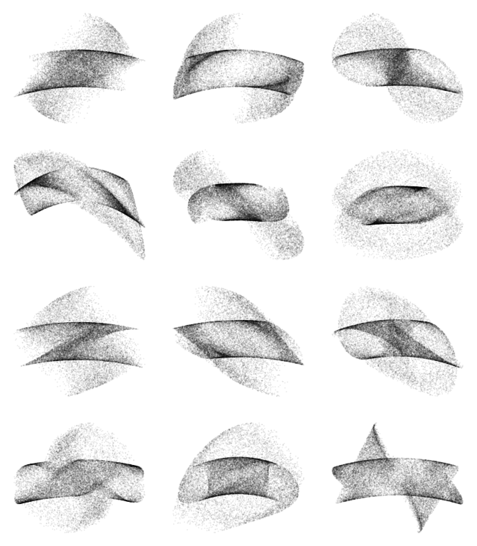
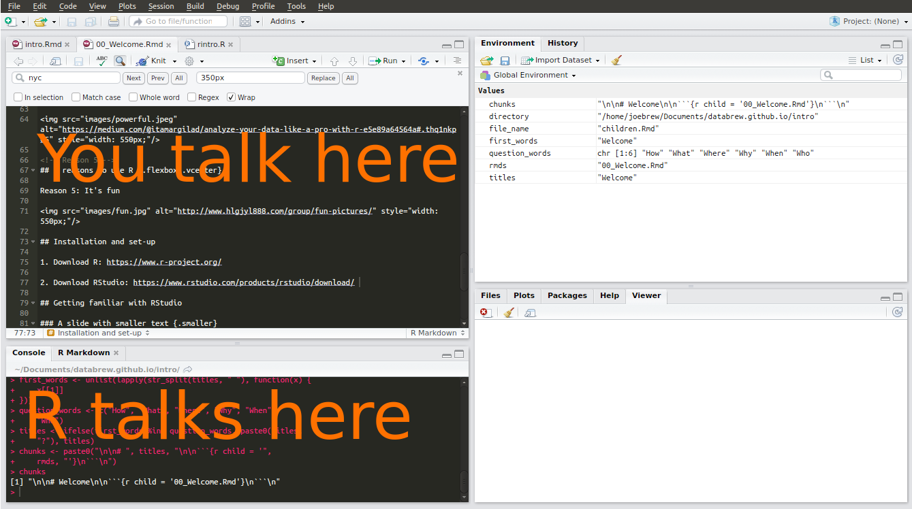

```{r, echo = FALSE}
knitr::opts_chunk$set(echo = TRUE)
```


## BEM VINDOS

These slides: 
http://www.databrew.cc/cism


### This course

- 6 classes
- 6 homework assignments
- 1 final exam
- 1 certificate of completion

### Rules

- Be on time (class starts at 15:00 exactly)
- Do your homework
- Ask for help

<!-- Reason 1 -->
## 5 reasons to use R {.flexbox .vcenter}

Reason 1: It's free


<!-- Reason 2 -->
## 5 reasons to use R {.flexbox .vcenter}

Reason 2: It's "open source"


<!-- Reason 3 -->
## 5 reasons to use R {.flexbox .vcenter}

Reason 3: It's beautiful



<!-- Reason 3 b-->
## 5 reasons to use R {.flexbox .vcenter}

Reason 3: It's beautiful



<!-- Reason 3 c-->
## 5 reasons to use R {.flexbox .vcenter}

Reason 3: It's beautiful



<!-- Reason 3 d-->
## 5 reasons to use R {.flexbox .vcenter}

Reason 3: It's beautiful


<!-- Reason 4 -->
## 5 reasons to use R {.flexbox .vcenter}

Reason 4: It's powerful


<!-- Reason 5 -->
## 5 reasons to use R {.flexbox .vcenter}

Reason 5: It's fun


## Installation and set-up

1. Download R: https://www.r-project.org/

2. Download RStudio: https://www.rstudio.com/products/rstudio/download/ 

## Getting familiar with RStudio {.flexbox .vcenter}



## First code

Let's write some code!

```{r, eval = FALSE}
2 + 2
```

## First code

Let's write some code!

```{r, eval = TRUE}
2 + 2
```

## First code

Let's write some code!

```{r, eval = TRUE}
x <- c(1,2,3,4,5)
```

## First code

Let's write some code!

```{r, eval = TRUE}
x
```

## First code

Let's write some code!

```{r, eval = TRUE}
barplot(x)
```


## Packages {.flexbox .vcenter}


## Packages

A "package" is simply a collection of code written by someone else.

It's what makes R _powerful_, but also _confusing_.

## Installing packages

You only have to install a package _one time_.

```{r, eval = FALSE}
install.packages('dplyr')
install.packages('devtools')
devtools::install_github('databrew/databrew')
devtools::install_github('joebrew/cism')
```

## Using packages

You have to use the `library` function _every_ time you use a package. 

```{r}
library(databrew)
library(cism)
library(sp)
```

Writing `library` just means "I am going to use this package".

## Using packages

Since we've already written `library(cism)`, now we can use some tools from the `cism` package.

## A map of Mozambique

```{r}
plot(moz0)
```

## A map of Manhiça

```{r}
plot(man3)
```

## Creating objects

```{r, eval = FALSE}
a <- 1
a + 3
```


## Creating objects

```{r, eval = TRUE}
a <- 1
a + 3
```

## Creating objects

Let's create an object called "ages", with the age of everyone

```{r, eval = FALSE}
ages <- c()
```


```{r, eval = TRUE, echo = FALSE}
ages <- c(30, 26, 31, 39, 45, 27, 28, 22, 19, 30, 35)
```

## Exploring objects

How do we view our `ages` object?

```{r, eval = FALSE}
ages
```


## Exploring objects

How do we view our `ages` object?

```{r, eval = TRUE}
ages
```

## Exploring objects

How do we view just the _first_ element of our `ages` object?

```{r, eval = FALSE}
ages[1]
```


## Exploring objects

How do we view just the _first_ element of our `ages` object?

```{r, eval = TRUE}
ages[1]
```

## Exploring objects

How do we _sort_ our `ages` object?

```{r, eval = TRUE}
sorted_ages <- sort(ages)
```

```{r, eval = TRUE}
sorted_ages
```

## Exploring objects

How do we get the minimum, maximum, average age?

```{r, eval = FALSE}
min(ages)
max(ages)
mean(ages)
```

## Exploring objects


```{r, eval = TRUE}
min(ages)
max(ages)
mean(ages)
```


## Visualizing objects

How do we visualize our `ages` object?

```{r, eval = TRUE}
hist(ages)
```

## Multi-dimensional objects

Previously, we looked at a one dimensional object: `ages`.

But most data is _two_ dimensional: rows and columns.

This is called a _data frame_.

Let's play around with some _real_ data.

## Multi-dimensional objects

Let's create a simple dataframe

www.databrew.cc/frangos.csv

```{r, echo = FALSE}
# http://koaning.io/theme/data/chickweight.csv
```


```{r}
frangos <- databrew::frangos
```

## Frangos {.build}

```{r}
head(frangos)
```

## Frangos {.build}

Let's explore.

Brackets: `[]`

## Let's filter

## Let's visualize


## Workflow, projects

1. Always save your scripts.

2. Never save your "workspace".

3. Work in "projects"


