```{r, echo = FALSE}
knitr::opts_chunk$set(echo = TRUE,
                      eval = TRUE)
```

## Does being pretty matter?


## Pie vs. Bar {.build}

```{r, echo = FALSE}
df <- data_frame(x = letters[1:10],
                 y = c(8.1, 11.9, 9.2, 7.8, 13.3, 6.7, 12.9, 10.1, 12.5, 7.5))
pie(df$y,
    labels = df$x)
```

## Pie vs. Bar {.build}


```{r, echo = FALSE}
library(ggplot2)
ggplot(data = df,
       aes(x = x,
           y = y)) +
  geom_bar(stat = 'identity',
           fill = 'darkgreen',
           alpha = 0.6) +
  labs(x = 'Letter',
       y = 'Value') +
  geom_hline(yintercept = seq(0, 12, by = 2),
             alpha = 0.3)
```

## Boxplot vs violin chart

```{r, echo = FALSE}
library(cism)
library(databrew)
weather <- get_weather('FQMA',
                       start_year = 2010,
                       end_year = 2017)


boxplot(weather$temp_max ~ format(weather$date, '%Y'),
        xlab = 'Year',
        ylab = 'Maximum temperature',
        main = 'Daily maximum temperature variation')
```

## Boxplot vs violin chart


```{r, echo = FALSE}
library(ggplot2)
ggplot(data = weather,
       aes(x = format(date, '%Y'),
           y = temp_max)) +
  geom_jitter(alpha = 0.3, size = 0.5) +
  geom_violin(alpha = 0.3,
              fill = 'darkorange') +
  labs(x = 'Year',
       y = 'Maximum temperature',
       title = 'Daily maximum temperature variation')
```

## Does being pretty matter?

Yes.

1. Effiency in conveying information (Information to time ratio).

2. ATTRACTiveness (increase the amount of time visualized).


## Good or bad?


## Good or bad?

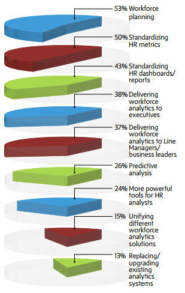

## Good or bad?

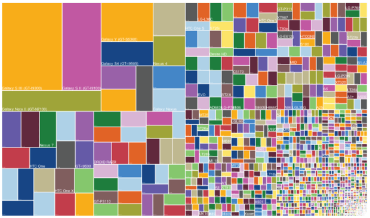

## Good or bad?

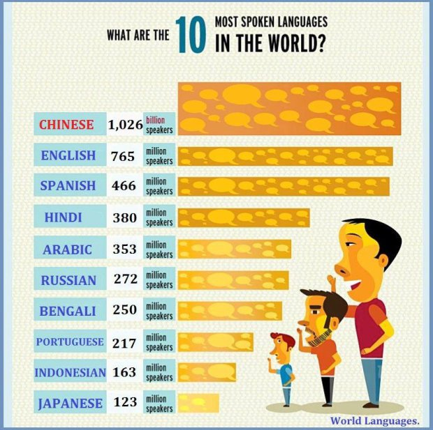

## Good or bad?


## Good or bad?


## Good or bad?

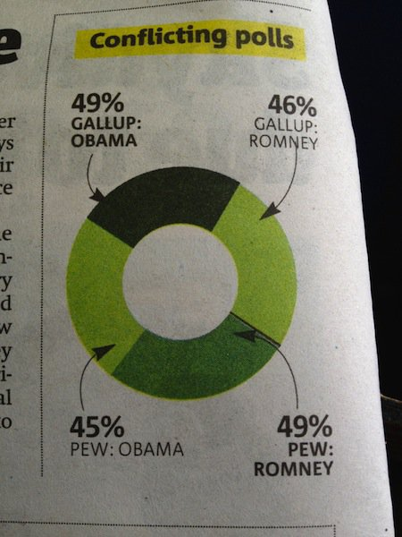

## Good or bad?

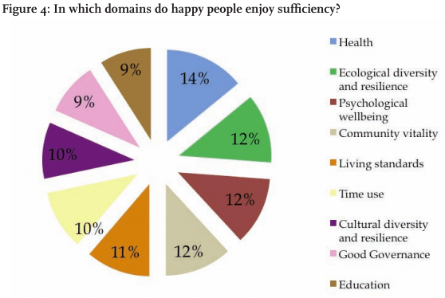

## Good or bad?

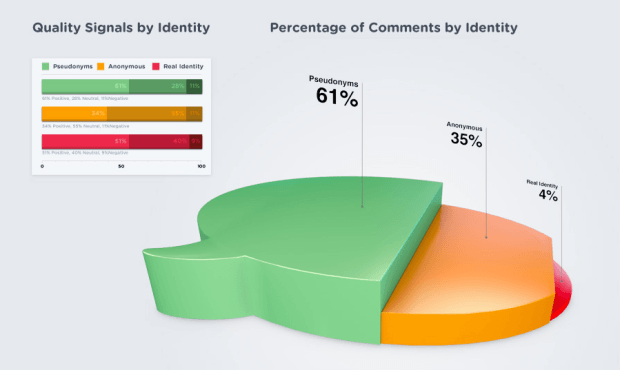


## Good or bad?

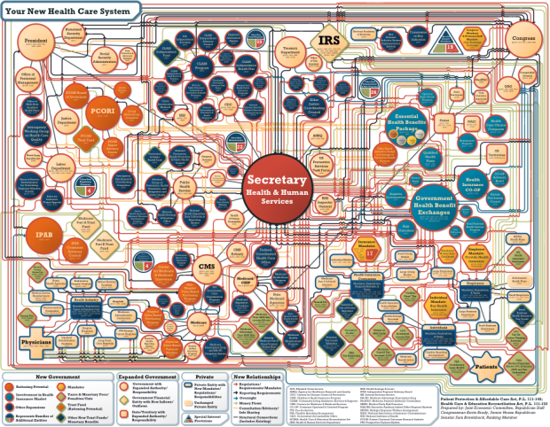

## Good or bad?


## Good or bad?


## Good or bad?

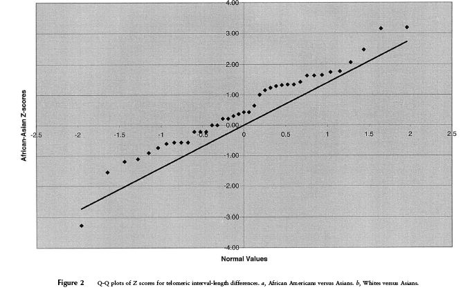


## Good or bad?

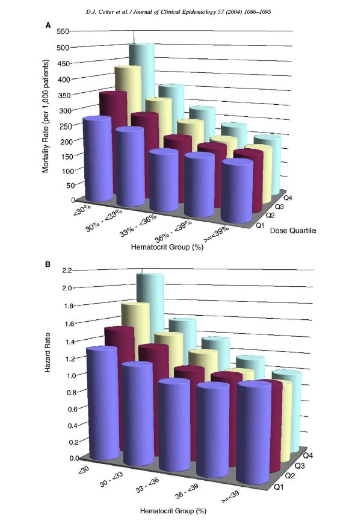


## Good or bad?

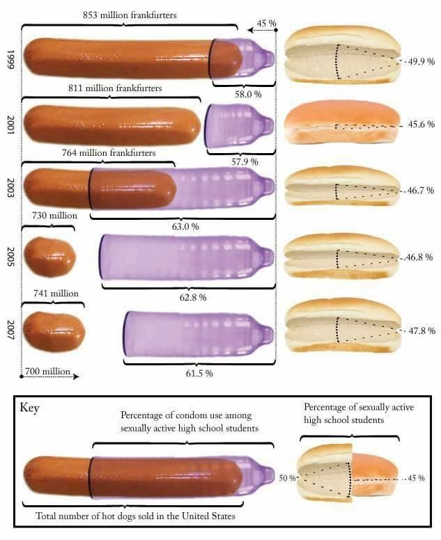


## Good or bad?

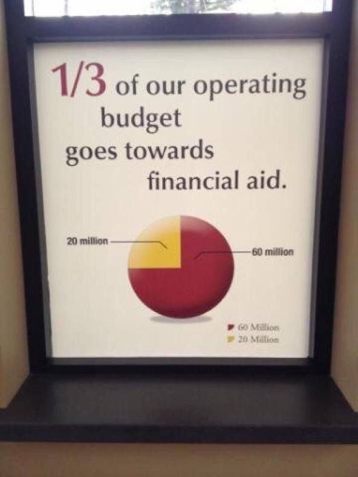


## Good or bad?


## Video on data visualization

https://ted.com/talks/david_mccandless_the_beauty_of_data_visualization

## `ggplot2`

```{r}
library(ggplot2)
library(ggthemes)
library(cism)
library(dplyr)
```

## First plot

```{r}
ggplot()
```

## Add a title

```{r}
ggplot() +
  labs(title = 'This is a title')
```

## Add a subtitle and some axes

```{r}
ggplot() +
  labs(title = 'This is a title',
       subtitle = 'This is a subtitle',
       x = 'X axis label goes here',
       y = 'Y axis label goes here')
```

## Let's get some data to plot

```{r}
survey <- MASS::survey
# Remove those without sex
survey <- survey %>%
  filter(!is.na(Sex))
```

## Make a histogram

```{r, eval = FALSE, echo = FALSE}
ggplot(data = survey, aes(x = Pulse)) +
  geom_histogram()
```

## Make the histogram pretty

Add a title, subtitle, fill, color, and transparency

```{r, eval = FALSE, echo = FALSE}
ggplot(data = survey,
       aes(x = Pulse)) +
  geom_histogram(color = 'grey',
                 fill = 'blue',
                 alpha = 0.5) +
  labs(title = 'Distribution of pulse',
       subtitle = 'Among survey participants',
       x = 'Beats per minute',
       y = 'People') 
```

## Make the histogram even more pretty

Add a theme

```{r, eval = FALSE, echo = FALSE}
ggplot(data = survey,
       aes(x = Pulse)) +
  geom_histogram(color = 'grey',
                 fill = 'blue',
                 alpha = 0.5) +
  labs(title = 'Distribution of pulse',
       subtitle = 'Among survey participants',
       x = 'Beats per minute',
       y = 'People') +
  theme_economist()
```

`theme_economist()`, `theme_wsj`, `theme_cism`, `theme_bw`, etc.

## Single variable: categorical

Make a barplot

```{r, eval = FALSE, echo = FALSE}
ggplot(data = survey,
       aes(x = Exer)) +
  geom_bar()
```

## Make the barplot pretty

Use arguments like `color`, `fill`, `alpha`, `labs` (title, subtitle, x, y)

## Facet the barplot

Use arguments like `color`, `fill`, `alpha`, `labs` (title, subtitle, x, y)

```{r, eval = FALSE, echo = FALSE}
ggplot(data = survey,
       aes(x = Exer)) +
  geom_bar() +
  facet_wrap(~Sex)
```


## Facet the histogram

Create a histogram of age, and facet it by sex.

```{r, eval = FALSE, echo = FALSE}
ggplot(data = survey,
       aes(x = Age)) + 
  geom_histogram() +
  facet_wrap(~Sex)
```

## Use `geom_density` instead of histogram

Create a histogram of pulse, and facet it by sex.

```{r, eval = FALSE, echo = FALSE}
ggplot(data = survey,
       aes(x = Pulse)) + 
  geom_density() +
  facet_wrap(~Sex)
```

## Instead of faceting, overlap

Create a histogram of age, and facet it by sex.

```{r, eval = FALSE, echo = FALSE}
ggplot(data = survey,
       aes(x = Pulse,
           fill = Sex)) + 
  geom_density(alpha = 0.5) 
```

## Create a barplot of smoking

Facet it by sex.

```{r, eval = FALSE, echo = FALSE}
ggplot(data = survey,
       aes(x = Smoke)) +
  geom_bar() +
  facet_wrap(~Sex)
```


## Create a two-variable chart

We're going to use two continuous variables

```{r, eval = FALSE, echo = FALSE}
ggplot(data = survey,
       aes(x = Age,
           y = Pulse)) +
  geom_point()
```

## Change the color and alpha

## Make the color by sex

```{r, eval = FALSE, echo = FALSE}
ggplot(data = survey,
       aes(x = Age,
           y = Pulse,
           color = Sex)) +
  geom_point()
```

## Make a point chart with two variables

On the x-axis, we'll use a categorical variable (Sex).
On the y-axis, a continuous one (Pulse).

```{r, eval = FALSE, echo = FALSE}
ggplot(data = survey,
       aes(x = Sex,
           y = Pulse)) +
  geom_point()
```

## Use `geom_jitter` instead of `geom_point`

```{r, eval = FALSE, echo = FALSE}
ggplot(data = survey,
       aes(x = Sex,
           y = Pulse)) +
  geom_jitter()
```

## Add another layer: `geom_boxplot`

```{r, eval = FALSE, echo = FALSE}
ggplot(data = survey,
       aes(x = Sex,
           y = Pulse)) +
  geom_jitter() +
  geom_boxplot()
```

## Add another layer: `geom_violin`

```{r, eval = FALSE, echo = FALSE}
ggplot(data = survey,
       aes(x = Sex,
           y = Pulse)) +
  geom_jitter() +
  geom_boxplot() +
  geom_violin()
```

## Make it prettier 

Use alpha, fill, color, etc.

## Get the census data

```{r, eval = FALSE, echo = FALSE}
census <- databrew::census
```

## Questions

1. Use `ggplot` to create a two variable scatterplot of longitude and latitude.

2. Use `ggplot` to create a histogram of age.

3. Use `ggplot` to create a "density" chart of age.

4. Use `ggplot` to create a two variable jittered point and violin chart of `sex` and `age`

```{r, eval = FALSE, echo = FALSE}
ggplot(data = census,
       aes(x = sex,
           y = age)) +
  geom_jitter() +
  geom_violin() +
  facet_wrap(~floor_material)
```

5. With the same chart you just created, use `facet_wrap` to create to create one chart for each kind of `floor_material`

## More questions

Let's get some new data

```{r}
frangos <- databrew::frangos
```

## More questions


6. Make a simple x-y chart of days and grams

7. Make the same chart, but make the color be a reflection of the diet

8. Make the same chart, but add a `geom_line()` argument to it.

```{r, echo = FALSE, eval = FALSE}
ggplot(data = frangos,
       aes(x = days,
           y = grams,
           color = diet)) +
  geom_point() +
  geom_line()
```

9. Make the same chart, but remove the `geom_line()` and add a `geom_smooth()`

```{r, echo = FALSE, eval = FALSE}
ggplot(data = frangos,
       aes(x = days,
           y = grams,
           color = diet)) +
  geom_point() +
  geom_smooth()
```

10. Make a new chart with days on the x axis, grams on the y axis, and facet it by diet.

```{r, echo = FALSE, eval = FALSE}
ggplot(data = frangos,
       aes(x = days,
           y = grams)) +
  geom_point() +
  facet_wrap(~diet)
```

## More questions

Let's use the census data.

1. Create a plot of everyone's locations.

2. Create a plot of everyone's locations, but color the points by `sex`

3. Create a plot of everyone's locations, color the points by `age`, and facet the plot by `wash_after_poop`.

4. Create a plot of everyone's locations, color the points by `celular`, make the point size a reflection of age, and facet the points by TWO variables using `facet_grid`: `car` and `pigs`

```{r, eval = FALSE, echo = FALSE}
ggplot(data = census,
       aes(x = longitude,
           y = latitude,
           size = age,
           color = celular)) +
  geom_point(alpha = 0.2) +
  facet_grid(car~pigs)
```

5. Make a density chart of the age variable in the census, and facet the chart by floor material.

## More questions

Let's use our census data again.

1. Create two new variables using `mutate`: (1) `longitude_round` and (2) `latitude_round`. This should be a rounding to one digit of the coordinates.

```{r}
census <- 
  census %>%
  mutate(longitude_round = round(longitude, digits = 1),
         latitude_round = round(latitude, digits = 1))
```

## More questions

2. Create an object called `x`. This will be the `census`, grouped by `longitude_round` and `latitude_round`, and then summarised to create a variable called `people` with the number of people.

3. Use `arrange` to find the least populated area.

4. Create a plot of all our people's locations, and ADD to that plot our rounded coordinates, with point size should be a reflection of the number of people.

```{r, eval = FALSE, echo = FALSE}
ggplot() +
  geom_point(data = census,
             aes(x = longitude,
                 y = latitude),
             alpha = 0.3,
             color = 'darkgreen') +
  geom_point(data = x,
       aes(x = longitude_round,
           y = latitude_round,
           size = people),
       color = 'red',
       alpha = 0.5) +
  theme_cism()
```